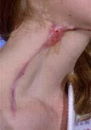
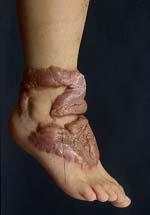
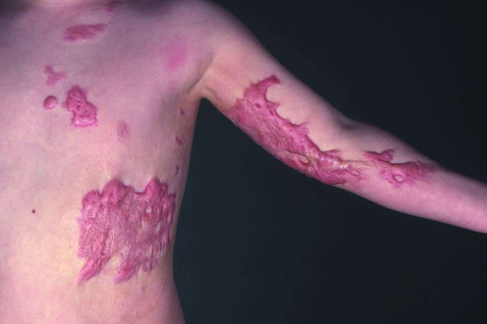
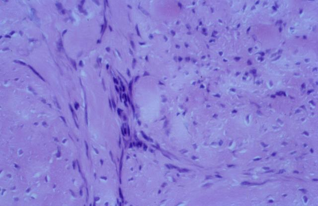
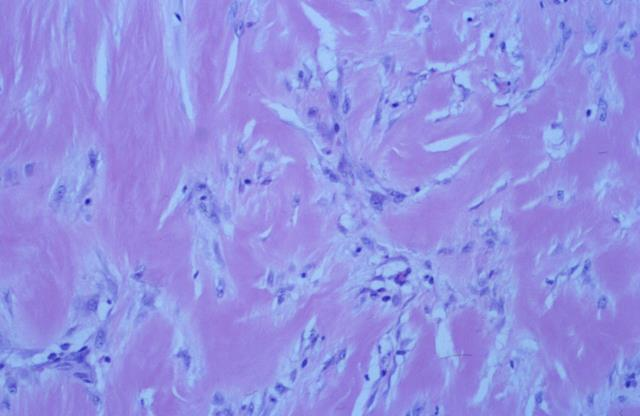

- # Elevated scars
	- **Definition** — raised scars that develop during the [[Wound healing|maturation phase]] of wound healing when remodelling is dysregulated, characterised by **excessive fibroblastic activity** with marked granulation tissue formation resulting in a **markedly raised scar**.
		- Source: Baja Ch. 5 p. 68; hist Wound Healing & Repair (Umar Mohammed, UDU Sokoto) slide 23
	- ## Clinical comparison
		- 
		- *Hypertrophic scar: single linear raised lesion, confined within the original wound margin. Source: hist Wound Healing & Repair slide 23.*
		- 
		- *Keloid scar: extensive raised tissue extending well beyond the original wound margin. Source: hist Wound Healing & Repair slide 23.*
		- 
		- *Multiple keloid scars on the chest and arm — note the raised, irregular lesions extending well beyond what would have been the original wound boundaries. Source: Bailey & Love Ch. 3 p. 49, Fig. 3.5.*
	- ## Histology comparison
		- 
		- 
		- *Paired histology images from the hist Wound Healing "Hypertrophic scar vs keloid" comparison slide. Slide-specific labels were not preserved in extraction — recall that **hypertrophic** scars show **parallel** collagen and **keloids** show **disorganised** collagen (Bailey & Love Ch. 3 p. 49). Verify against the original slide for definitive identification.*
	- ## Types of elevated scars
		- [[Hypertrophic scar]] — raised but **confined to the original wound margins**; eventually regresses
		- [[Keloid scar]] — raised, **extends beyond the original wound margins**; does not spontaneously regress
		- Source: hist Wound Healing slide 23; Bailey & Love Ch. 3 p. 49
	- ## Differences between hypertrophic and keloid scars
		- | Feature | [[Hypertrophic scar]] | [[Keloid scar]] |
		- | --- | --- | --- |
		- | **Boundary** | Confined *within* original wound margin | Extends *beyond* original wound margin |
		- | **Natural history** | Eventually regresses spontaneously | Does **not** spontaneously regress; persists |
		- | **Collagen architecture** | **Parallel** pattern of excess collagen | **Disorganised** pattern of excess collagen |
		- | **Trigger** | Areas of increased tension; wounds crossing tension lines; deep dermal burns; wounds healing by secondary intention > 3 weeks | Often follows **relatively minor trauma**; strong **genetic** predisposition |
		- | **Risk groups** | Burn scars; younger patients | Darker-skinned individuals; younger patients; burn scars particularly liable |
		- | **Predilection sites** | Anywhere under tension | **Ear, beard area, neck, chest** |
		- | **Treatment response** | Often responds to conservative measures | **Difficult to treat**; tendency to recur |
		- Source (boundary, natural history, collagen pattern, trigger, treatment response): Bailey & Love Ch. 3 p. 49
		- Source (risk groups, predilection sites): Baja Ch. 5 p. 68
	- Related: [[Wound healing]], [[Wound]], [[Hypertrophic scar]], [[Keloid scar]]
